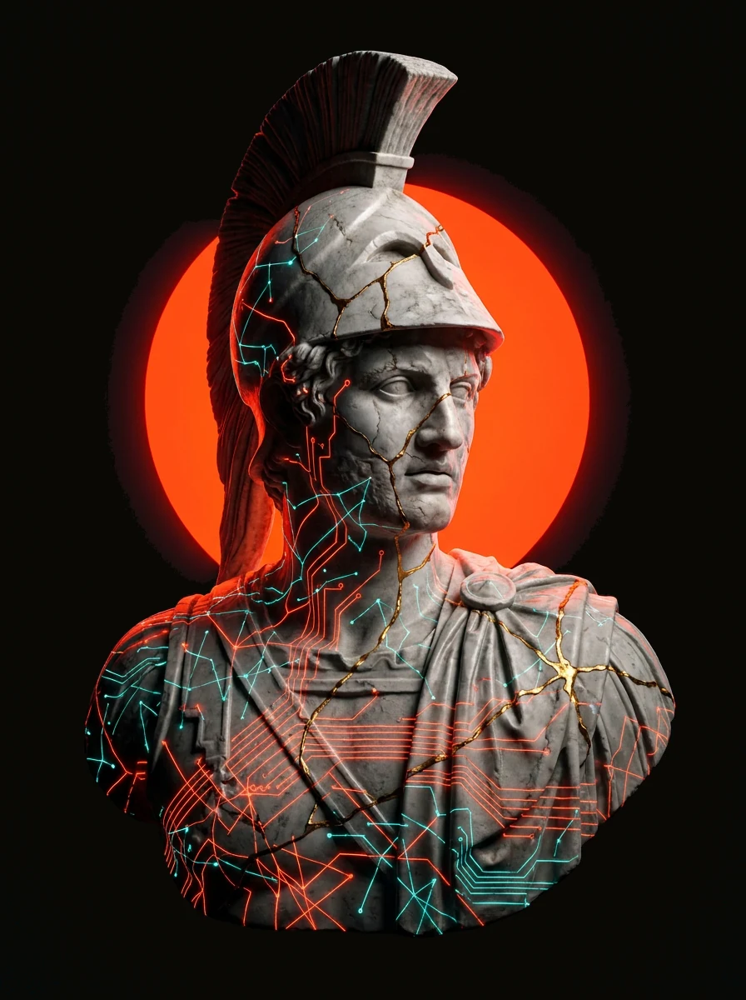
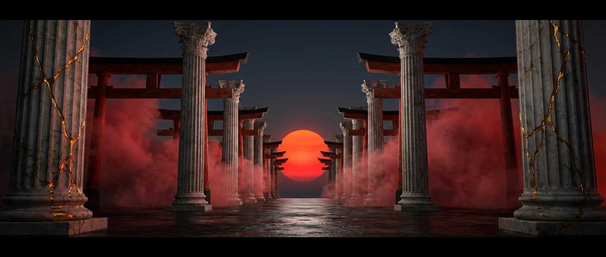
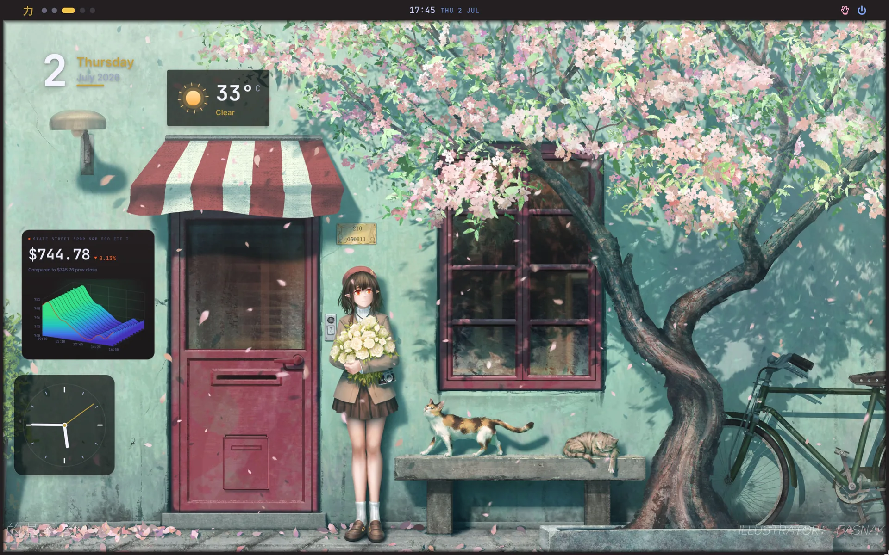
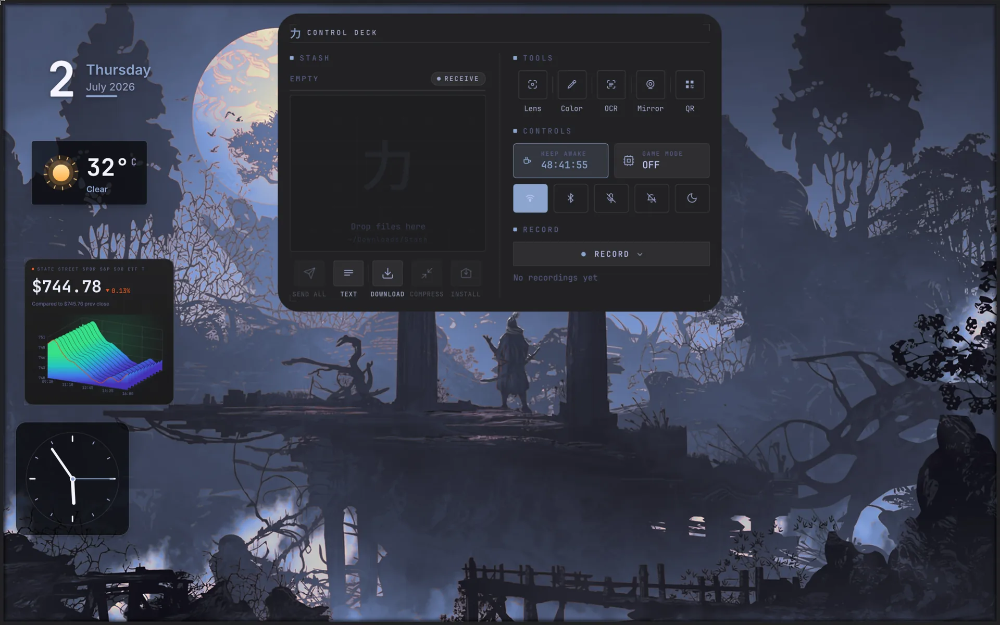

 

### 力 &nbsp; whoami

Cybersecurity &amp; network engineer. I take systems apart to learn how they
break, then build them back sharper. Creator of **[Ryoku](https://ryoku.dev)** —
a hand-built Arch Linux desktop where the whole shell is written from scratch.

I live close to the wire: packets, protocols, and the machines that route them;
hardened Linux; tools that respect the person at the keyboard. Power and beauty,
in that order, and never one without the other.

- **Recon &amp; offense** &nbsp;—&nbsp; reconnaissance, network security, the quiet craft of not being seen
- **Systems &amp; shells** &nbsp;—&nbsp; hand-built desktops, hand-written Quickshell, no framework tax
- **Local-first** &nbsp;—&nbsp; tooling that runs on your machine, on your terms

 

### 力 &nbsp; ryoku

**[Ryoku](https://ryoku.dev)** is an opinionated, premium Arch workstation:
classical beauty carrying warrior power, cracked and mended in gold, shot on
black. The Hyprland config is Lua, the shell is Quickshell / QML, the installer
and tooling are Go. It ships as signed packages.

> *For the sake of power and beauty.*

**[ryoku.dev](https://ryoku.dev)** &nbsp;·&nbsp; [Docs](https://docs.ryoku.dev) &nbsp;·&nbsp; [Source](https://github.com/neur0map/ryoku-arch) &nbsp;·&nbsp; [Discord](https://discord.gg/8KjBmUEyKA) &nbsp;·&nbsp; [r/RyokuArch](https://www.reddit.com/r/RyokuArch/)

 &nbsp; 

### 力 &nbsp; selected work

**[glazepkg](https://github.com/neur0map/glazepkg)** &nbsp; `Go` &nbsp; 
 The official RyokuArch package manager. Every package you have installed, from every source, in one clear place.

**[prowl-agent](https://github.com/neur0map/prowl-agent)** &nbsp; `Go` &nbsp; 
 A local-first config-intelligence backend. It lets coding agents read a ricing / dotfiles setup over MCP — what owns each file, how to reload it, what breaks if you touch it.

### 力 &nbsp; stack

### 力 &nbsp; connect

---

Art forged with `fal-ai/nano-banana-pro` and mended by hand. Built in the open, with kansha (感謝).

力
